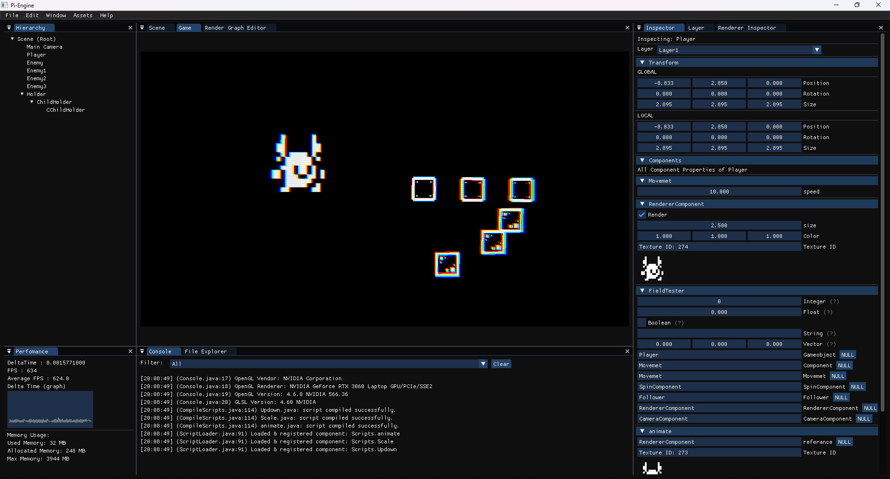
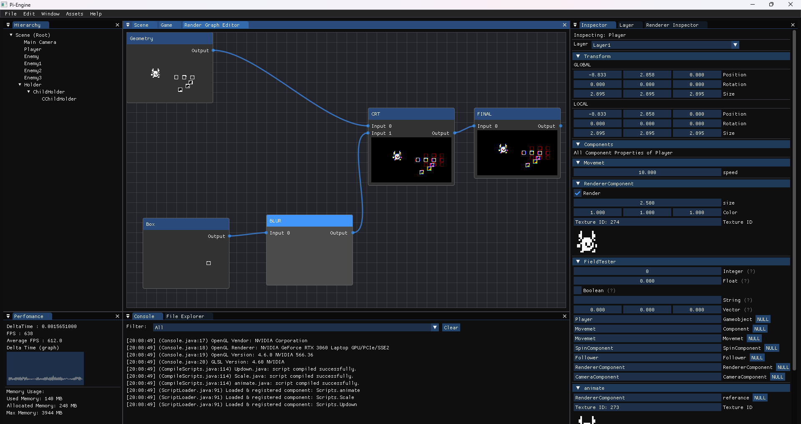

# PiEngine 
Made with love, learning, and long sleepless nights.

PiEngine is a modular, component-based Java game engine built from scratch for 2D and (eventually) 3D games. It was created as a college project with a focus on learning, customization, and full control over the game development pipeline.

### 🎥 PiEngine Demo
[](https://www.youtube.com/watch?v=3pVAaNRfhNo)



## Documentation

Comprehensive documentation is available in the [`docs/`](docs/README.md) folder. It covers:
- Math utilities ([Math](docs/Math/README.md))
- GameObject/entity system ([GameObject](docs/GameObject/README.md))
- Components ([Components](docs/Components/README.md))
- Core engine systems ([Core](docs/Core/README.md))

Each section includes function/property tables, usage examples, best practices, and cross-references. Start with [`docs/README.md`](docs/README.md) for an index of all docs.

> **Acknowledgment**
>
> Much of the documentation for PiEngine was generated with the help of GitHub Copilot (AI), under the supervision and review of the core developers ([Shri Hari (TanPi)](https://github.com/ItsTanPI) and [Gunavarthan](https://github.com/Gunavarthan)).
> As a small team with limited time, we used AI tools to accelerate the writing process and ensure comprehensive, high-quality docs for the community. All content was checked and curated by us.

## Features

- Component-based architecture (just extend `Component`)
- Built-in ImGui editor (Scene view, Game view, Inspector)
- Node-based rendering pipeline with external GLSL shader support
- Modular JSON-based scene saving and prefab system
- Hot-loadable components (runtime script loading)
- Input abstraction system
- Asset loader for 2D sprites/images
- Fully open-source under MIT License

## Folder Structure

```
Pi-Engine/
├── src/
│   └── main/
│       └── java/
│           └── org/PiEngine/   # Core engine code
├── resources/
│   ├── shaders/                # External GLSL shaders
│   └── Test.json               # Sample scene
├── docs/                       # Engine documentation (see above)
├── build.gradle                # Gradle setup

```


## Getting Started

### Requirements

- Java 17 or newer
- Gradle
- Windows (tested; Linux/Mac support unverified)

### Build & Run

```bash
git clone https://github.com/ItsTanPI/Pi-Engine.git
cd Pi-Engine
./gradlew run
```
lternatively, run the `Main.java` file from your IDE.

## Creating Components

To create a new component, extend the `Component` base class and implement your logic. Components are automatically serialized and can be hot-loaded during runtime.

## Scene System

Scenes are saved as hierarchical JSON files. Prefabs are supported by saving a scene and instancing it as an object. Object references are path-based (e.g. `/main/player/hand/weapon`).

Example: [`resources/Test.json`](https://github.com/ItsTanPI/Pi-Engine/blob/main/src/main/resources/Test.json)

## Rendering System

- Node-based render passes (input/output images and shaders)
- Uses external GLSL shader files (`resources/shaders/`)
- Basic passes available; system is designed to be extended easily
- Built with future 3D support in mind

## Roadmap

- Physics system
- 3D model import (GLTF/OBJ)
- Scene transitions
- UI system
- Audio support
- Cross-platform testing
- Scripting (interpreter-based)
- Vulkan + C++ rewrite in the future

## Credits

PiEngine is a personal and collaborative project created with dedication, curiosity, and lots of late nights.

**Developed by:**
- [Shri Hari (TanPi)](https://github.com/ItsTanPI)
- [Gunavarthan](https://github.com/Gunavarthan)

We started this project as part of our college work, and it became a dream journey into game engine development. This engine represents our first step toward learning how real engines are built — and we’re excited to keep improving it with the help of the open-source community.

## Discord
 - [Join the Discord Channel](https://github.com/ItsTanPI/Pi-Engine)


## Contributing

This project is open-source and we welcome contributions. If you're interested:

1. Fork the repository
2. Make your changes
3. Submit a pull request

We (the original developers) will review and merge contributions. The goal is to build a community-driven, custom game engine like Blender or Godot.

## License

This project is licensed under the MIT License. See the [LICENSE](https://github.com/ItsTanPI/Pi-Engine/blob/main/LICENSE) file for details.
